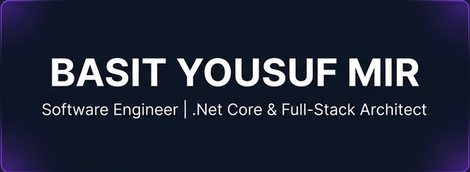

  

<h1 align="center">
  Hi there, I'm <a href="https://github.com/basitmir2020">Basit Yousuf Mir</a> 
  
</h1>

  

  
  
  

---

### 🚀 About Me

- 🔭 I’m currently working on building **scalable full-stack applications** and **cross-platform mobile apps**.
- 🌱 I’m currently learning advanced ASP.NET Core and **.NET MAUI** for high-performance mobile development.
- 💬 Ask me about **PHP, JavaScript, C# (.NET), or .NET MAUI**.
- 📫 How to reach me: `work.basityousufmir@gmail.com`

---

### 🛠️ Skills & Technologies

#### 💻 Frontend

#### 🏗️ Frontend Frameworks

#### 📚 Frontend Libraries

#### ⚙️ Backend

#### 📱 Mobile

#### 🎨 Design & Creative

#### ☁️ DevOps & Cloud

#### 🗄️ Database

#### 🛠️ Tools & Ecosystem

---

### 📈 GitHub Stats

  

  

---

### 🤝 Connect with Me

  
  
  

  <i>"Code is like humor. When you have to explain it, it’s bad."</i> – Cory House

